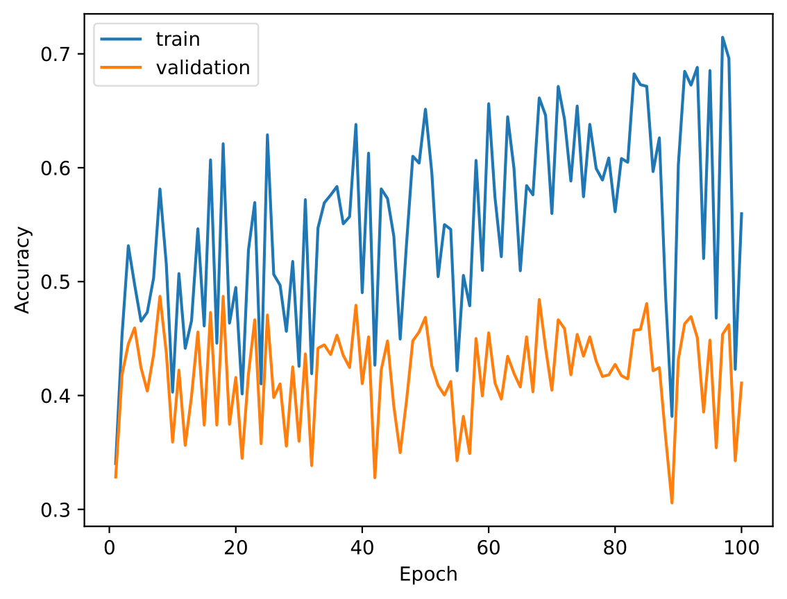
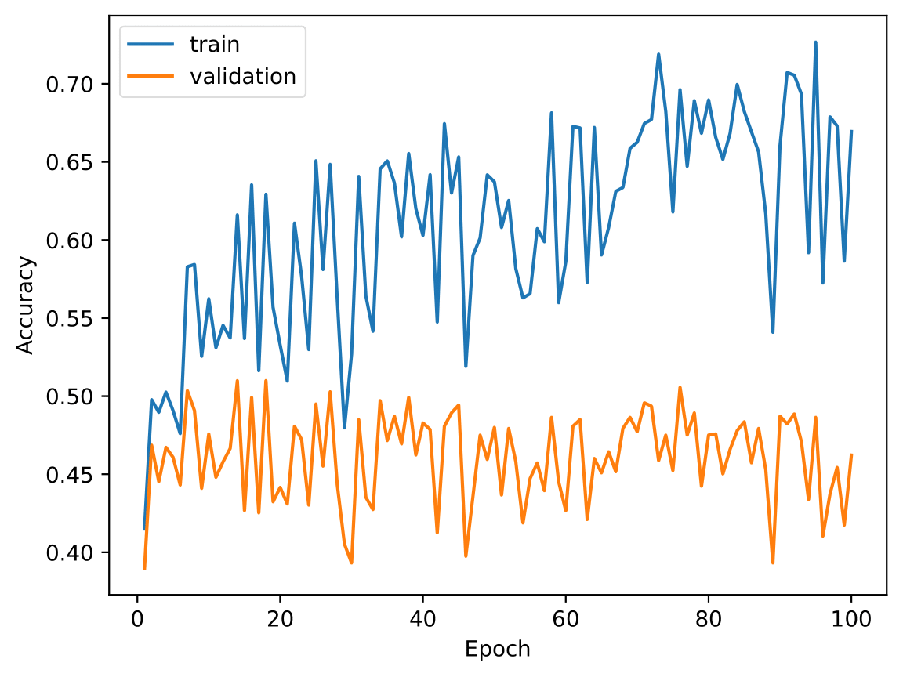
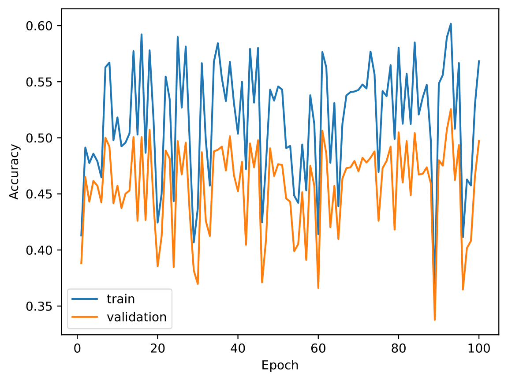
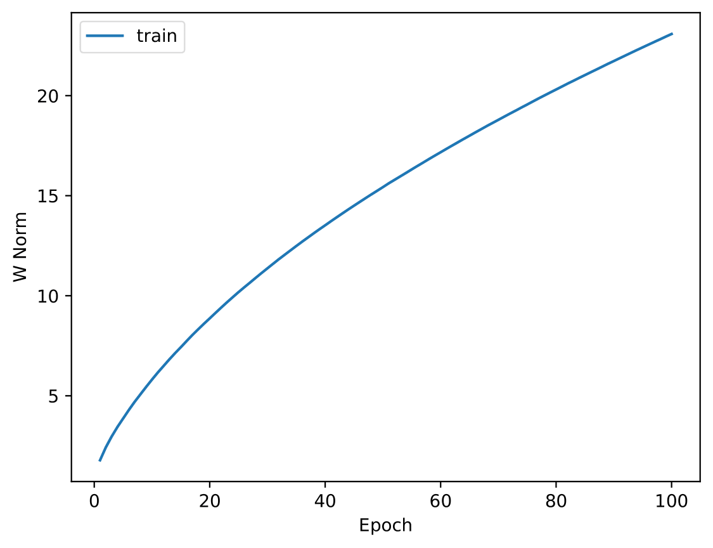
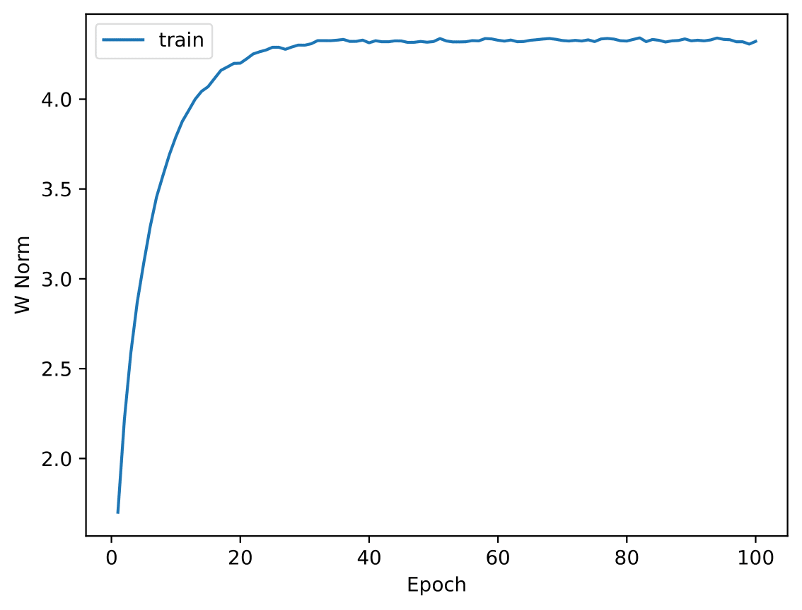

# Question 1

### 1a
- training accuracy:    0.5596
- validation accuracy:  0.4110
- test accuracy:        0.3853

### 2a
- test accuracy:    0.4597

### 2b
- test accuracy:    0.5053

Comparing the training and validation accuracies across the stochastic gradient descent epochs, we can see that without regularization the training accuracies tend to be better than with it. Therefore the differences between traing and validation accuracies are greater and tend to increase with the number of epochs, which can make us infer a tendency for overfitting of the model. 

So our analysis enforce that regularization prevents overfitting as expected in theory, reducing and stabilizing the gap between training and testing accuracies. Furthermore the final test accuracy is better including the regularization.

### 2c

According to the obtained values, it is visible that without regularization the weights tendency is to increase over the epochs and with regularization the weights become more stable and also smaller than non-regularized ones.

If the weight becomes too large, the regularization term adds a larger penalty, making the loss function increase and leading to the smaller weights seen in the graphics. Therefore preventing overfitting and reducing the impact of noise in the training data.

### 2d
As _l2_ regularization, using _l1_ regularization the weights are smaller than non-regularized weights, thus preventing overfitting. The main difference between these regularizations is that _l1_ encourages sparsity. Features with small weights have high probability to be set to zero during training. As of _l1_ norm is defined as the summation of absolute values, the gradient changes abruptly and favours a solution where many weights "spike" down to zero (at sparse points) reducing the number of non-zero weights, which leads some features to be completely ignored and to have fewer but more active features. That does not happen in _l2_ regularization that spreads the penalty evenly across all weights, encouraging them to be small but not zero.