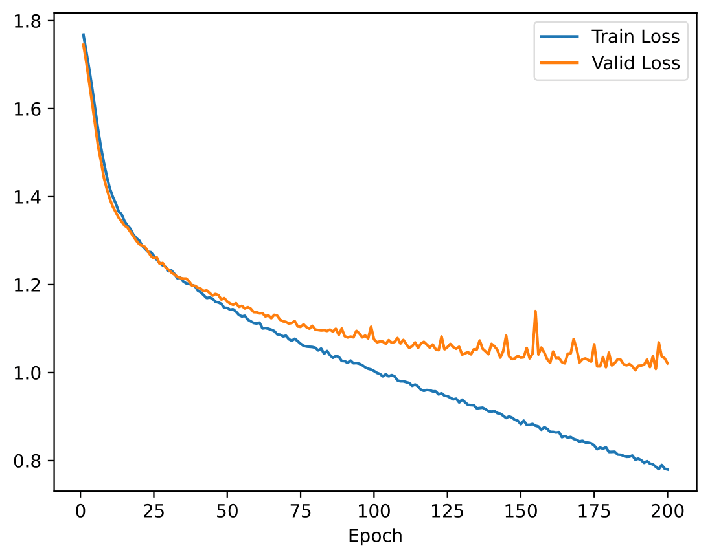

# Question 1

### 1a
```
python hw1-q1.py perceptron -epochs 100
```
- training accuracy:    0.5598
- validation accuracy:  0.3868
- test accuracy:        0.3743


### 2a
```
python hw1-q1.py logistic_regression -epochs 100
```
- test accuracy:    0.4597


### 2b
```
python hw1-q1.py logistic_regression -epochs 100 -l2_penalty 0.01
```
- test accuracy:    0.5053


Comparing the training and validation accuracies across the stochastic gradient descent epochs, we can see that without regularization the training accuracies tend to be better than with it. Therefore the differences between traing and validation accuracies are greater and tend to increase with the number of epochs, which can make us infer a tendency for overfitting of the model. 

So our analysis enforce that regularization prevents overfitting as expected in theory, reducing and stabilizing the gap between training and testing accuracies. Furthermore the final test accuracy is better including the regularization.


### 2c


According to the obtained values, it is visible that without regularization the weights tendency is to increase over the epochs and with regularization the weights become more stable and also smaller than non-regularized ones.

If the weight becomes too large, the regularization term adds a larger penalty, making the loss function increase and leading to the smaller weights seen in the graphics. Therefore preventing overfitting and reducing the impact of noise in the training data.


### 2d
As _l2_ regularization, using _l1_ regularization the weights are smaller than non-regularized weights, thus preventing overfitting. The main difference between these regularizations is that _l1_ encourages sparsity. Features with small weights have high probability to be set to zero during training. As of _l1_ norm is defined as the summation of absolute values, the gradient changes abruptly and favours a solution where many weights "spike" down to zero (at sparse points) reducing the number of non-zero weights, which leads some features to be completely ignored and to have fewer but more active features. That does not happen in _l2_ regularization that spreads the penalty evenly across all weights, encouraging them to be small but not zero.


### 3a
```
python hw1-q1.py mlp
```
- test accuracy:    0.5417


# Question 2

### 1
```
python hw1-q2.py logistic_regression -epochs 100 -batch_size 32 -l2_decay 0.01 -learning_rate <learning_rate>
```
Note: learning_rate = [0.00001; 0.001; 0.1]

- learning_rate = 0.00001
    - validation accuracy:  0.2892
    - test accuracy:        0.3087
- learning_rate = 0.001
    - validation accuracy:  0.4751
    - test accuracy:        0.4827
- learning_rate = 0.1
    - validation accuracy:  0.3091
    - test accuracy:        0.3093


Best validation accuracy for learning rate 0.001 (validation accuracy = 0.4751)

As it is possible to observe by the validation accuracy results and by the validation loss curves, from learning rates tested the closest to be optimal is `0.001`.

It is perceivable that with very low (like `0.00001`) learning rates the curve is almost straight, and the weights are being updated steadly but very slowly, which does not make possible to verify any aprroximation to a convergence point in which the loss curve reaches a minimum.

That is not the case when looking at the curve asssociated with the l.r. that lead to the best result. We can notice the loss decreases smoothly, almost flattening along the epochs which indicates convergence.

In the other hand, a very high learning rate (like `0.1`) cause the loss to fluctuate and possible increase, which shows instability, overshooting the minimum and bouncing around instead of settling.

### 2a
```
python hw1-q2.py mlp
python hw1-q2.py mlp -batch_size 512
```
- batch_size default
    - validation accuracy:  0.6061
    - test accuracy:        0.6073
    - time execution:       3 minutes and 51 seconds
- batch_size 512
    - validation accuracy:  0.5028
    - test accuracy:        0.5190
    - time execution:       2 minutes and 6 seconds




The best performance is observed with the default batch size (64). However, the execution time is shorter with the batch size set to 512. This happens because the weights need to be updated less frequently — specifically, dataset_size / batch_size times. Having a lower batch size implies a more computationally demanding classification task.

Despite this, a lower batch size allows the model to learn more effectively and capture specific patterns in the data, leading to a better accuracy. Even though, it tends to overfitting (what can be seen in the loss plots, in which the validation loss flattens regardless of the dropping related with the training loss).

### 2b
```
python hw1-q2.py mlp -dropout 0.01
python hw1-q2.py mlp -dropout 0.25
python hw1-q2.py mlp -dropout 0.5
```


- dropout = 0.01
    - validation accuracy:  0.5762
    - test accuracy:        0.5803
- dropout = 0.25
    - validation accuracy:  0.6083
    - test accuracy:        0.6057
- dropout = 0.5
    - validation accuracy:  0.5990
    - test accuracy:        0.5960

Using a low dropout value (e.g. 0.01) only a small fraction of neurons are inactive during training, which translates in a minimal impact in terms of preventing overfitting (this is evident in the loss graph, where for this dropout rate it shows the most pronounced signs of overfitting). When dropout value is 0.5, half neurons are inactive during each training epoch, besides improving in generalization, it may start to excessively limit the network’s capacity to learn patterns, particularly in some cases where the model struggles to converge effectively within each epoch, what is translated in a decreasing of performance. The drop in accuracy from 0.25 enforce this fact.

The best results are from training with dropout 0.25, which may indicate a better trade-off between overfitting and underfitting risks. 


### 2c
```
python hw1-q2.py mlp -batch_size 1024 -momentum 0.0
python hw1-q2.py mlp -batch_size 1024 -momentum 0.9
```

- momentum = 0.0
    - validation accuracy:  0.4701
    - test accuracy:        0.4883
- momentum = 0.9
    - validation accuracy:  0.5990
    - test accuracy:        0.6010


It is possible to verify that with a higher momentum it is achieved a better performance.
From the plots it can be seen that the convergence is faster when a momentum is applied. Hence, less epochs are needed for assisting to smaller loss values.
Moreover, the account for the weight of past gradients in the updates helps the algorithm to avoid being stuck in local minimum or saddle points and to get closer to the global minimum, attainning higher accuracy values.
